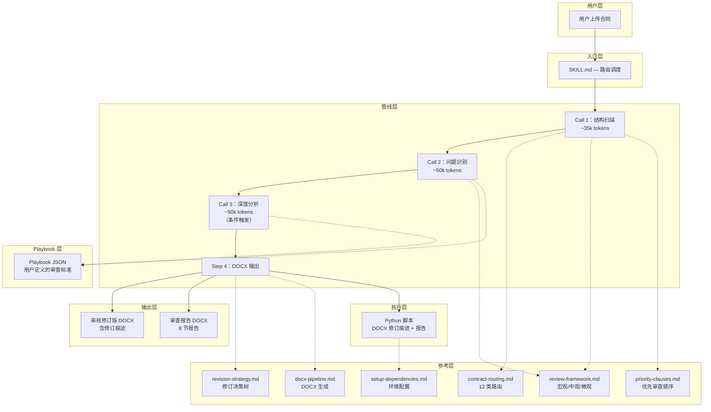

# 架构说明

## 概述

Contract Copilot Engine 是一个面向 AI 编程助手的 **4 阶段合同审查管线**。作为 skill 运行在 AI 编程助手内部，编排 3 次顺序 LLM 调用和 1 个 DOCX 生成步骤。

## 系统分层

## 管线详解

### Call 1：结构扫描（~35k tokens）

**输入**：合同全文
**输出**：路由卡 + 宏观/中观层发现

| 步骤 | 动作 | 参考文件 |
|------|------|----------|
| 1. 合同类型识别 | 路径/关键词匹配 → 12 类路由 | `contract-routing.md` |
| 2. Playbook 路由 | 命中增强映射表 → 加载 Playbook | `config/playbooks/` |
| 3. 宏观层扫描 | 主体资格、标的合法性、程序完备性、交易结构 | `review-framework.md` §1.1 |
| 4. 中观层扫描 | 合同形式、格式条款提示、附件一致性 | `review-framework.md` §1.2 |
| 5. 反馈注入 | 历史纠正记录自动注入 | `feedbackCorrections.records[]` |

### Call 2：问题识别（~50k tokens）

**输入**：Call 1 输出 + 合同全文
**输出**：结构化问题清单（P0/P1/P2）

| 步骤 | 动作 |
|------|------|
| 1. Playbook 按需加载 | 匹配 `clauseTypes` 关键词 → 仅加载匹配条目（5-10k tokens） |
| 2. 四维审核 | 业务风险、法律专业性、条款一致性、业务需求还原度 |
| 3. 条款级比对 | 合同条款 → `standard[]` → 通过/偏离 → `acceptable[]` → `redFlags[]` → `fallback` |
| 4. 问题格式化 | 风险名称 / 等级 / 后果 / 判别标准 / 推荐措辞 / 法条依据 / 整改建议 / 相关条款 |
| 5. 风险排序 | 效力与程序 → 资金与交付 → 救济与退出 → 文本优化 |

### Call 3：深度分析（~50k tokens，条件触发）

**触发条件**：P0 ≥ 3、金额 ≥ 1 亿、上市公司、跨境、或对赌协议
**入口**：用户手动确认

**输入**：Call 2 问题清单
**输出**：模式分析 + 审批触发汇总 + 谈判优先级

| 步骤 | 动作 |
|------|------|
| 1. 模式提炼 | 从示范文本中提炼交易结构模式、保护条款组合、缺位条款类型 |
| 2. 合同映射 | 将提炼的模式映射到实际合同，识别缺口 |
| 3. 审批触发 | 汇总 Call 2 + Call 3 命中的全部升级触发项 |
| 4. 谈判优先级 | 将问题重新编排为三个梯队，附 fallback 和 commonCounter |

### Step 4：DOCX 输出

**输入**：Call 1-3 全部输出
**输出**：两份 DOCX 文件

| 文件 | 内容 |
|------|------|
| `[合同名]_审核修订版.docx` | 合同原文 + 修订痕迹 + 批注 |
| `[合同名]_审查报告.docx` | 8 节正式审查报告 |

**降级路径**：Python 脚本失败时 → pandoc 生成报告 DOCX + 修订标注 Markdown（含 `[审查批注: ...]` 标记）。

## 扩展点

### Playbook JSON

主要扩展机制。每个 Playbook 是一个 JSON 文件，为特定行业/合同类型定义条款标准、风险分级、审批规则和谈判策略。详见 `config/playbooks/playbook.schema.json`。

### 合同类型文件（`contract-types/`）

用户按 12 类合同创建子目录（01-sale、02-lease 等），填充条款级细化文件。由 `priority-clauses.md` 和 `revision-strategy.md` 引用。本引擎不包含具体条款内容。

### 领域知识（AGENTS.md / CLAUDE.md）

四维审核法、审核标准和输出规范在项目 AGENTS.md 或 CLAUDE.md 中定义，不包含在引擎内。此分离设计保持引擎的领域无关性。

## Token 预算

| 阶段 | 预算 |
|------|------|
| Call 1 | ~35k tokens |
| Call 2 | ~50k tokens |
| Call 3 | ~50k tokens（条件触发） |
| Playbook 加载 | 5-10k tokens（按需加载，对比传统 Reference 的 30k tokens） |
| **合计（无 Call 3）** | **~85-95k tokens** |
| **合计（含 Call 3）** | **~135-145k tokens** |
