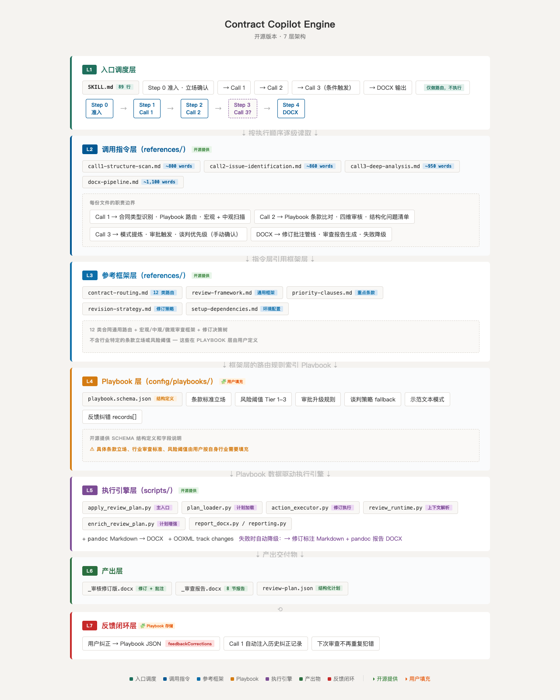

# Contract Copilot Engine

[](LICENSE)

> AI 辅助合同审查引擎 — 框架开源，领域知识自行填充。

Contract Copilot Engine 是一个面向 AI 编程助手（Claude Code / Codex / Copilot CLI）的合同审查 skill 框架。它提供 multi-call 管道架构、路线规划、Playbook 匹配、DOCX 修订批注生成的完整流程，但不包含任何行业特定的审查标准或条款立场——这些由用户通过结构化 Playbook JSON 自行填充。

## 核心理念

- **框架开源** — 管道架构、路由逻辑、DOCX 生成管线均可自由使用和修改
- **领域知识自行填充** — 条款标准立场、风险阈值、审批层级通过 `config/playbooks/*.json` 由用户按自身行业需求定义
- **促进交易** — 审查目标不是拒绝交易，是帮助交易安全落地

## 快速开始

### 前置条件

- AI 编程助手（Claude Code / Codex / Copilot CLI）
- Python 3.9+
- Pandoc（用于 Markdown → DOCX 转换）

### 安装

```bash
git clone https://github.com/YOUR_USERNAME/contract-copilot-engine.git ~/.cc-switch/skills/legal/contract-copilot
cd ~/.cc-switch/skills/legal/contract-copilot
python3 -m pip install -r scripts/requirements.txt
```

### 配置

1. 编辑 `config/reviewer_profile.json`：填写审查人信息
2. 创建 `config/playbooks/` 下的 Playbook JSON：按 `playbook.schema.json` 结构定义你的条款标准和风险阈值

### 使用

在 AI 编程助手中上传合同文件，skill 自动触发：

```
审查这份合同：/path/to/contract.docx
```

引擎执行 3 次调用 + DOCX 输出：
1. **Call 1 — 结构扫描**：识别合同类型，匹配 Playbook，宏观/中观层检查
2. **Call 2 — 问题识别**：条款级比对，输出结构化问题清单（P0/P1/P2）
3. **Call 3 — 深度分析**：条件触发，关键合同模式检查 + 审批触发 + 谈判策略
4. **DOCX 输出**：修订批注一体版 + 审查报告

## 架构



```
contract-copilot-engine/
├── SKILL.md                    # 路由入口（调度）
├── references/                 # 审查指令
│   ├── call1-structure-scan.md
│   ├── call2-issue-identification.md
│   ├── call3-deep-analysis.md
│   ├── contract-routing.md     # 12 类合同通用路由
│   ├── docx-pipeline.md
│   ├── review-framework.md     # 宏观/中观/微观框架
│   ├── revision-strategy.md
│   ├── priority-clauses.md
│   └── setup-dependencies.md
├── config/
│   ├── reviewer_profile.example.json
│   ├── review_memory.example.json
│   └── playbooks/
│       └── playbook.schema.json  # Playbook 结构定义（用户自行填充）
└── scripts/                    # Python 脚本（DOCX 修订批注）
    ├── review/
    ├── docx/
    └── report/
```

详见 [ARCHITECTURE.md](ARCHITECTURE.md)。

## Playbook 系统

Playbook 是本引擎的核心扩展点。每个行业/合同类型创建一个 JSON 文件，定义：

- **条款标准立场** — `standard[]` / `acceptable[]` / `redFlags[]`
- **风险分级** — Tier 1（Deal-breaker）/ Tier 2（可谈判）/ Tier 3（优化项）
- **审批触发规则** — 偏离时自动升级至对应层级
- **谈判策略** — fallback / commonCounter
- **反馈纠错** — 用户纠正自动写入 `feedbackCorrections.records[]`，下次审查自动注入

详见 `config/playbooks/playbook.schema.json`。

## 自定义

1. 创建 `contract-types/` 目录，按 12 类合同分别填充条款细化文件
2. 在 `config/playbooks/` 下创建行业特定的 Playbook JSON
3. 在调用环境中配置 AGENTS.md / CLAUDE.md 定义领域知识和审核标准

## 与私有 Playbook 配合

本仓库仅包含审查引擎。实际使用时，将私有的 Playbook JSON 和合同类型文件放在工程目录下，通过 AI 编程助手的项目配置引用。推荐目录结构：

```
your-project/
├── AGENTS.md                    # 领域知识（四维审核法、审核标准）
├── config/playbooks/            # 私有 Playbook JSON（不入本仓库）
│   ├── sale.json
│   ├── lease.json
│   └── ...
├── contract-types/              # 合同类型细化文件（不入本仓库）
└── cases/                       # 待审查合同文件
```

## 作者

**孤獨的自由** — 房地产法务，Contract Copilot 体系设计者。

如有商业合作或定制化 Playbook 开发需求，欢迎联系。

微信号：**maoo8486**

---
## 贡献

欢迎通过 Issue 和 PR 参与贡献。详见 [CONTRIBUTING.md](CONTRIBUTING.md)。

## 许可

MIT License — 详见 [LICENSE](LICENSE)。
